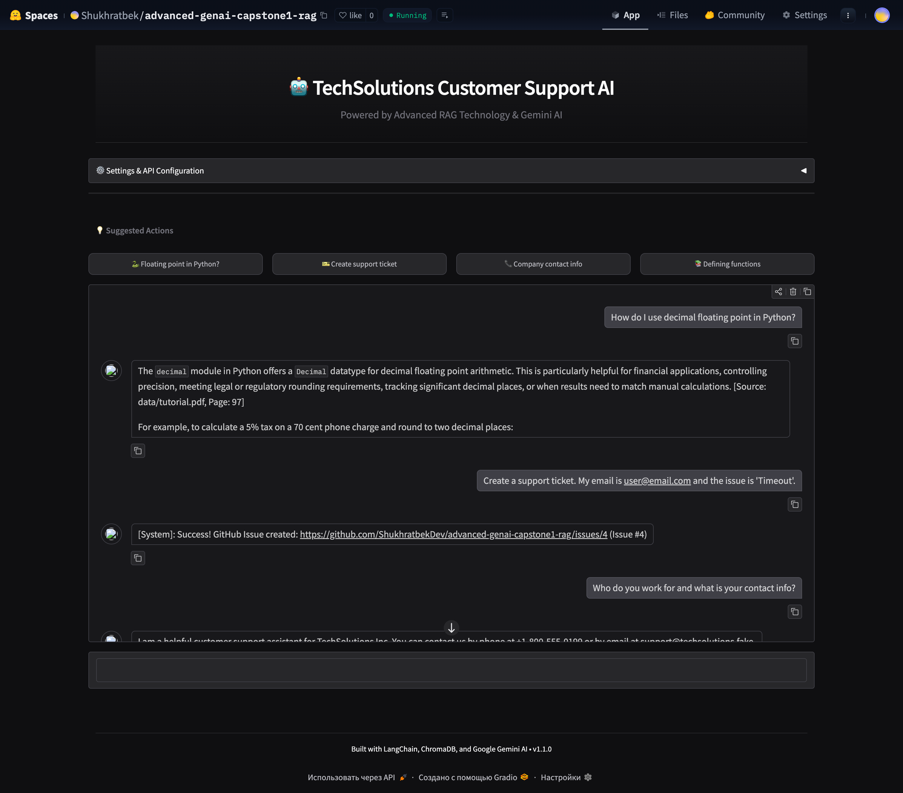

# TechSolutions Support AI v1.1.0
**Student**: Antigravity AI
**Course**: Advanced Generative AI



## 1. Project Overview
This solution is a **premium Customer Support RAG system** designed for "TechSolutions Inc." It features a modern, clean enterprise-style UI that allows users to query technical manuals and policies with an exceptional user experience. If a solution is not found, the system intelligently creates a support ticket.

### ✨ Design Highlights
- **Modern Enterprise UI**: Professional clean theme with refined neutral colors and subtle accents.
- **Card-Based Layout**: Simplified, structured design with ample whitespace and clear typography.
- **Responsive Design**: Fully optimized for desktop and mobile devices.
- **Enhanced UX**: Quick action suggestion buttons for common queries.
- **Semantic HTML**: Built using modern web standards for better accessibility and performance.

See [DESIGN_IMPROVEMENTS.md](DESIGN_IMPROVEMENTS.md) for detailed design documentation.

## 2. Technical Architecture
- **Language**: Python 3.10+
- **Frameworks**: LangChain, ChromaDB, **Gradio 6.5+**
- **LLM**: Google Gemini (Supports `gemini-2.5-flash`, `gemini-3-flash-preview`, etc.)
- **Embeddings**: HuggingFace Embeddings (`all-MiniLM-L6-v2`)
- **Integration**: GitHub API (via `PyGithub`) for ticket creation
- **UI**: Clean CSS with modern enterprise aesthetics

### Key Components
1.  **Data Ingestion (`data_ingestion.py`)**:
    -   Loads PDFs/Text from `data/`
    -   Chunks and stores embeddings in ChromaDB (Serverless/Embedded)
2.  **RAG Engine (`rag_engine.py`)**:
    -   Retrieves relevant chunks and enforces source citation.
    -   **GitHub Integration**: Automated ticket creation via GitHub API.
3.  **User Interface (`app.py`)**:
    -   **Modern Gradio** Web UI with custom styling and model selection.
    -   Settings interface for `GOOGLE_API_KEY`, `GITHUB_TOKEN`, and `GITHUB_REPO`.
4.  **Custom Styling (`custom_styles.css`)**:
    -   Refined enterprise-style CSS with custom component styling.

## 3. Data Sources Used
-   `data/library.pdf` (Primary Technical Manual)
-   `data/tutorial.pdf` (Secondary Manual)
-   `data/company_policies.txt` (Internal Docs)

## 4. Quick Start

### Option 1: Using the Start Script (Recommended)
```bash
./start.sh
```

### Option 2: Manual Setup
```bash
# Install dependencies
pip install -r requirements.txt

# Ingest data (first time only)
python data_ingestion.py

# Launch the application
python app.py
```

The application will open at `http://localhost:7860`

## 5. Configuration

### Environment Variables
Create a `.env` file or use the UI settings:
```env
GOOGLE_API_KEY=your_google_api_key_here
GITHUB_TOKEN=your_github_token_here  # Optional
GITHUB_REPO=username/repository      # Optional
```

### UI Configuration
All settings can be configured through the **⚙️ Settings & API Configuration** accordion in the web interface.

## 6. Deployment (Hugging Face Spaces)

### Automated Deployment
```bash
python deploy_to_hf.py
```

### Manual Deployment
1. Upload all files to your Hugging Face Space
2. Set secrets in Space settings:
   - `GOOGLE_API_KEY` (Required)
   - `GITHUB_TOKEN` (Optional)
   - `GITHUB_REPO` (Optional)

### Note on Dependencies
The `pysqlite3-binary` package in `requirements.txt` is only needed for Hugging Face Spaces. For local development, it can be skipped.

## 7. Features

### 🤖 AI-Powered Support
- Context-aware responses using RAG technology
- Multi-document knowledge base
- Link-style source citations (e.g., [Source: file, Page: X])

### 🎫 Ticket Creation
- Automatic GitHub issue creation
- Extracts user info and issue summary intelligently
- Seamless integration with GitHub API

### 🎨 Premium UI/UX
- Clean, minimalist enterprise-style interface
- Dark theme with professional neutral color palette
- Quick action suggestions for better discovery
- Dynamic AI model selection via settings

### ⚡ Performance
- Streaming responses for real-time feedback
- Efficient vector search with ChromaDB
- Optimized local embeddings (MiniLM)

## 8. Project Structure
```
.
├── app.py                          # Main Gradio application
├── rag_engine.py                   # RAG logic and GitHub integration
├── data_ingestion.py               # Data loading and embedding
├── custom_styles.css               # Clean enterprise styling
├── requirements.txt                # Python dependencies
├── deploy_to_hf.py                # Hugging Face deployment script
├── start.sh                        # Quick start script
├── DESIGN_IMPROVEMENTS.md          # Design documentation
├── DESIGN_COMPARISON.md            # Analysis of design changes
├── DESIGN_SUMMARY.md               # Executive summary of UI/UX
├── data/                           # Knowledge base documents
│   ├── library.pdf
│   ├── tutorial.pdf
│   └── company_policies.txt
└── chroma_db_v4/                   # Vector database (generated)
```

## 9. Technology Stack
- **LangChain**: RAG orchestration
- **ChromaDB**: Vector database
- **Google Gemini**: Large language model
- **Gradio**: Web interface framework
- **PyGithub**: GitHub API integration
- **HuggingFace**: Embedding models

## 10. License
MIT License - See LICENSE file for details

